# 🏗️ DOCUFIND Architecture

> **Comprehensive System Design and Technical Specifications**

## 📖 Table of Contents

- [System Overview](#-system-overview)
- [Core Components](#-core-components)
- [MCP Implementation](#-mcp-implementation)
- [Data Flow](#-data-flow)
- [API Integrations](#-api-integrations)
- [Storage Architecture](#-storage-architecture)
- [Security Model](#-security-model)
- [Performance Considerations](#-performance-considerations)
- [Extensibility](#-extensibility)

## 🎯 System Overview

DOCUFIND follows a **modular, event-driven architecture** built around the **Model Context Protocol (MCP)** for intelligent document processing. The system is designed with **separation of concerns**, **scalability**, and **maintainability** as core principles.

### High-Level Architecture

```mermaid
graph TB
    subgraph "External Systems"
        A[📧 Email Servers<br/>IMAP/SMTP]
        B[☁️ Google Drive API]
        C[📊 Google Sheets API]
        D[🔍 Gmail API]
    end
    
    subgraph "DOCUFIND Core"
        E[🎯 Main Application<br/>find_documents_main.py]
        F[📧 Email Processor<br/>email_processor.py]
        G[🤖 Invoice Extractor<br/>invoice_extractor.py]
        H[☁️ Drive Client<br/>google_drive_client.py]
        I[⚙️ Config Manager<br/>config_manager.py]
    end
    
    subgraph "MCP Layer"
        J[📋 Resources]
        K[🛠️ Tools]
        L[💭 Prompts]
    end
    
    subgraph "Storage & Output"
        M[📁 Organized Files]
        N[📊 Tracking Spreadsheets]
        O[📝 Processing Logs]
    end
    
    A --> F
    D --> F
    F --> E
    E --> G
    G --> H
    H --> B
    H --> C
    B --> M
    C --> N
    I --> E
    I --> F
    I --> G
    I --> H
    
    J --> K
    K --> L
    L --> G
    
    E --> O
    
    style E fill:#ff9999
    style J fill:#99ccff
    style K fill:#99ccff
    style L fill:#99ccff
```



## 🧩 Core Components

### 1. **Main Application** (`find_documents_main.py`)

**Role**: Orchestration and workflow management

**Responsibilities**:
- Initialize and coordinate all components
- Manage processing pipeline
- Handle user interactions and CLI
- Generate reports and notifications
- Error handling and recovery

**Key Methods**:
```python
class FindDocumentsApp:
    def process_documents(start_date, end_date, keywords, folder_name)
    def _process_single_email(email, attachments)
    def _generate_final_report()
    def send_completion_email()
```

**Design Patterns**:
- **Facade Pattern**: Simplifies complex subsystem interactions
- **Command Pattern**: Encapsulates processing requests
- **Observer Pattern**: Progress notifications and logging

### 2. **Email Processor** (`email_processor.py`)

**Role**: Email connectivity and message processing

**Responsibilities**:
- IMAP connection management
- Email search and filtering
- Message parsing and decoding
- Attachment extraction
- Multi-provider support

**Key Methods**:
```python
class EmailProcessor:
    def connect() -> bool
    def search_emails(start_date, end_date, keywords) -> List[Dict]
    def get_email_details(email_id) -> Dict
    def get_attachments(email_id) -> List[Dict]
    def _build_search_criteria() -> str
```

**Architecture Features**:
- **Connection Pooling**: Efficient IMAP connection reuse
- **Retry Logic**: Automatic retry on network failures
- **Encoding Handling**: Multi-charset email support
- **Provider Abstraction**: Unified interface for different email providers

### 3. **Invoice Extractor** (`invoice_extractor.py`)

**Role**: AI-powered data extraction and parsing

**Responsibilities**:
- Pattern-based data extraction
- Content analysis and cleaning
- Context-aware processing
- Confidence scoring
- Data validation

**Key Methods**:
```python
class InvoiceExtractor:
    def extract_invoice_data(content, context) -> Dict
    def _extract_with_patterns(text) -> Dict
    def _enhance_with_context(data, text) -> Dict
    def _calculate_confidence(data) -> float
```

**AI/ML Components**:
- **Regex Patterns**: 50+ extraction patterns for different invoice formats
- **Context Analysis**: Uses email metadata for improved accuracy
- **Confidence Scoring**: Statistical confidence in extracted data
- **Pattern Learning**: Adapts to new invoice formats over time

### 4. **Google Drive Client** (`google_drive_client.py`)

**Role**: Cloud storage and spreadsheet management

**Responsibilities**:
- Google Drive API integration
- Hierarchical folder creation
- File upload and organization
- Spreadsheet generation and updates
- Metadata management

**Key Methods**:
```python
class GoogleDriveClient:
    def create_folder_structure(folder_name) -> Dict
    def upload_file(file_data, path, metadata) -> str
    def get_or_create_spreadsheet(name) -> str
    def add_row_to_spreadsheet(sheet_id, row_data)
```

**Storage Architecture**:
```
FIND_DOCUMENTS/
├── ProjectName_2024/
│   ├── 2024/
│   │   ├── 01/           # January
│   │   │   ├── Email_12345/
│   │   │   │   ├── invoice.pdf
│   │   │   │   └── receipt.pdf
│   │   │   └── Email_12346/
│   │   └── 02/           # February
│   └── Tracking_Sheet_20241201.xlsx
```

### 5. **Config Manager** (`config_manager.py`)

**Role**: Configuration management and validation

**Responsibilities**:
- Configuration loading and parsing
- Environment variable handling
- Credential management
- Validation and error checking
- Runtime configuration updates

**Configuration Schema**:
```json
{
  "email": {
    "username": "string",
    "password": "string", 
    "imap_server": "string",
    "imap_port": "number"
  },
  "google_drive": {
    "credentials_path": "string",
    "root_folder": "string"
  },
  "extraction": {
    "confidence_threshold": "number",
    "custom_patterns": "object"
  }
}
```

## 🔌 MCP Implementation

### Model Context Protocol Integration

DOCUFIND implements MCP for intelligent document processing with context awareness.

#### **Resources**
MCP resources provide structured access to system state:

```python
# mcp://email/search/filtered
{
  "uri": "mcp://email/search/filtered",
  "name": "Filtered Email Search",
  "description": "Search emails with advanced filters",
  "mimeType": "application/json"
}

# mcp://drive/folder/structure  
{
  "uri": "mcp://drive/folder/structure",
  "name": "Drive Folder Structure",
  "description": "Current Google Drive organization",
  "mimeType": "application/json"
}

# mcp://spreadsheet/data/current
{
  "uri": "mcp://spreadsheet/data/current", 
  "name": "Spreadsheet Data",
  "description": "Current processing data",
  "mimeType": "application/json"
}
```

#### **Tools**
MCP tools provide callable functionality:

```python
# process_email_search
{
  "name": "process_email_search",
  "description": "Process emails with intelligent filtering",
  "inputSchema": {
    "type": "object",
    "properties": {
      "start_date": {"type": "string"},
      "end_date": {"type": "string"},
      "keywords": {"type": "array"},
      "folder_name": {"type": "string"}
    }
  }
}

# extract_invoice_data
{
  "name": "extract_invoice_data", 
  "description": "Extract structured data from invoices",
  "inputSchema": {
    "type": "object",
    "properties": {
      "content": {"type": "string"},
      "context": {"type": "object"}
    }
  }
}
```

#### **Prompts**
MCP prompts provide intelligent analysis:

```python
# Invoice Analysis Prompt
{
  "name": "analyze_invoice_content",
  "description": "Analyze email content for invoice data",
  "prompt": """
  Analyze the following email content for invoice information:
  
  Email Context:
  - Sender: {sender}
  - Subject: {subject} 
  - Date: {date}
  
  Content:
  {content}
  
  Extract:
  1. Invoice amount and currency
  2. Vendor/supplier name
  3. Invoice number
  4. Due date
  5. Description/concept
  
  Provide confidence score (0-1) for each extracted field.
  """
}
```

## 🔄 Data Flow

### Processing Pipeline


### Data Transformation Pipeline


### State Management

```python
# Processing State
{
  "session_id": "uuid",
  "start_time": "timestamp",
  "status": "processing|completed|error",
  "progress": {
    "total_emails": 100,
    "processed": 45,
    "successful": 42,
    "failed": 3
  },
  "current_email": {
    "id": "email_id", 
    "subject": "Invoice #123",
    "status": "processing"
  },
  "statistics": {
    "success_rate": 0.933,
    "total_attachments": 67,
    "extracted_invoices": 59
  }
}
```

## 🔗 API Integrations

### Google Drive API v3

**Authentication**: OAuth 2.0 with service account
**Scopes**: `https://www.googleapis.com/auth/drive`

**Key Operations**:
- File upload and management
- Folder creation and organization  
- Metadata updates
- Permission management

**Rate Limiting**: 1000 requests per 100 seconds per user

### Google Sheets API v4

**Authentication**: Shared with Drive API
**Scopes**: `https://www.googleapis.com/auth/spreadsheets`

**Key Operations**:
- Spreadsheet creation
- Row insertion and updates
- Formatting and styling
- Formula management

### Email Provider APIs

#### Gmail API
- **Scope**: `https://www.googleapis.com/auth/gmail.readonly`
- **Rate Limiting**: 1 billion quota units per day
- **Advanced Features**: Search expressions, thread management

#### IMAP Protocol
- **Supported Providers**: Gmail, Outlook, Yahoo, custom servers
- **Security**: TLS/SSL encryption
- **Connection Management**: Connection pooling and keep-alive

## 💾 Storage Architecture

### File Organization Strategy

```
Storage Hierarchy:
├── Configuration Layer
│   ├── credentials.json (encrypted)
│   ├── config.json 
│   └── .env (environment variables)
├── Processing Layer  
│   ├── temp/ (temporary processing files)
│   └── logs/ (application logs)
└── Output Layer
    └── Google Drive
        └── FIND_DOCUMENTS/
            ├── Project folders
            ├── Organized files by date
            └── Tracking spreadsheets
```

### Database Schema (Spreadsheet)

| Column | Type | Description |
|--------|------|-------------|
| ID | String | Unique email identifier |
| ProcessingDate | DateTime | When processed |
| EmailDate | DateTime | Original email date |
| Sender | String | Email sender |
| Subject | String | Email subject |
| HasAttachments | Boolean | Attachment presence |
| AttachmentCount | Number | Number of attachments |
| InvoiceAmount | Currency | Extracted amount |
| Vendor | String | Vendor/supplier name |
| InvoiceNumber | String | Invoice identifier |
| Concept | Text | Description/concept |
| Confidence | Percentage | Extraction confidence |
| FilePath | String | Google Drive path |

## 🔒 Security Model

### Authentication & Authorization


### Security Best Practices

1. **Credential Management**:
   - OAuth 2.0 for Google services
   - App passwords for email (never primary passwords)
   - Environment variables for sensitive data
   - Encrypted credential storage

2. **Data Protection**:
   - TLS/SSL for all network communications
   - Local temporary file encryption
   - Secure deletion of processed files
   - No sensitive data in logs

3. **Access Control**:
   - Principle of least privilege
   - Scope-limited API permissions
   - Regular credential rotation
   - Audit logging

## ⚡ Performance Considerations

### Scalability Metrics

| Component | Current Limit | Optimization Strategy |
|-----------|---------------|----------------------|
| Email Processing | 1000 emails/hour | Connection pooling, batch processing |
| File Upload | 100MB/file | Chunked upload, compression |
| API Calls | Google limits | Request batching, caching |
| Memory Usage | 512MB typical | Streaming, garbage collection |
| Concurrent Processing | 5 parallel streams | Thread pool, async I/O |

### Performance Optimizations

1. **Email Processing**:
   - IMAP connection reuse
   - Parallel email fetching
   - Selective content download
   - Progressive result streaming

2. **Data Extraction**:
   - Compiled regex patterns
   - Content preprocessing
   - Pattern caching
   - Early termination on high confidence

3. **Cloud Operations**:
   - Batch API calls
   - Resumable uploads
   - Metadata caching
   - Request deduplication

### Monitoring & Metrics

```python
# Performance Metrics
{
  "processing_metrics": {
    "emails_per_minute": 15.7,
    "extraction_accuracy": 0.954,
    "api_response_time": 245,  # milliseconds
    "memory_usage": 387,       # MB
    "error_rate": 0.012
  },
  "resource_usage": {
    "cpu_percent": 23.4,
    "memory_percent": 18.9,
    "disk_io_rate": 12.3,     # MB/s
    "network_io_rate": 8.7    # MB/s
  }
}
```

## 🔧 Extensibility

### Plugin Architecture

```python
# Plugin Interface
class ProcessorPlugin:
    def process(self, email_data: Dict) -> Dict:
        """Process email data and return enhanced results"""
        pass
    
    def validate_config(self, config: Dict) -> bool:
        """Validate plugin configuration"""
        pass

# Example Plugin Implementation
class CustomInvoicePlugin(ProcessorPlugin):
    def process(self, email_data: Dict) -> Dict:
        # Custom processing logic
        return enhanced_data
```

### Configuration Extensions

```json
{
  "plugins": {
    "enabled": ["custom_invoice", "ocr_processor"],
    "custom_invoice": {
      "patterns_file": "custom_patterns.json",
      "confidence_threshold": 0.8
    }
  },
  "extraction_rules": {
    "custom_fields": ["purchase_order", "tax_rate"],
    "validation_rules": ["amount > 0", "date <= today"]
  }
}
```

### API Extensions

Future API endpoints for external integrations:

```python
# REST API Endpoints (Planned)
POST /api/v1/process
GET  /api/v1/status/{session_id}
GET  /api/v1/results/{session_id}
POST /api/v1/configure
GET  /api/v1/metrics
```

## 🎯 Design Decisions & Trade-offs

### Architectural Choices

1. **Synchronous vs Asynchronous**:
   - **Choice**: Primarily synchronous with async I/O for network operations
   - **Rationale**: Simpler debugging and error handling for batch processing
   - **Trade-off**: Lower concurrency but higher reliability

2. **File-based vs Database**:
   - **Choice**: Google Sheets as primary database
   - **Rationale**: User-friendly, integrated with Google ecosystem
   - **Trade-off**: Less query flexibility but better user adoption

3. **Pattern-based vs ML**:
   - **Choice**: Regex patterns with ML enhancement planned
   - **Rationale**: Faster deployment, easier debugging
   - **Trade-off**: Less adaptability but more predictable results

### Future Architecture Evolution


## 📊 Component Dependencies

### Dependency Graph


### External Dependencies

| Package | Version | Purpose | License |
|---------|---------|---------|---------|
| google-api-python-client | >=2.0.0 | Google APIs | Apache 2.0 |
| google-auth-httplib2 | >=0.1.0 | Authentication | Apache 2.0 |
| google-auth-oauthlib | >=0.5.0 | OAuth flow | Apache 2.0 |
| requests | >=2.25.0 | HTTP client | Apache 2.0 |
| python-dotenv | >=0.19.0 | Environment variables | BSD-3 |
| logging | builtin | Application logging | PSF |
| re | builtin | Pattern matching | PSF |
| json | builtin | Data serialization | PSF |
| imaplib | builtin | Email protocol | PSF |
| email | builtin | Email parsing | PSF |
| base64 | builtin | Data encoding | PSF |
| datetime | builtin | Date/time handling | PSF |

## 🔍 Error Handling Strategy

### Error Categories

```python
# Error Hierarchy
class DocufindError(Exception):
    """Base exception for DOCUFIND"""
    pass

class EmailConnectionError(DocufindError):
    """Email server connection issues"""
    pass

class AuthenticationError(DocufindError):
    """Authentication and authorization errors"""  
    pass

class ExtractionError(DocufindError):
    """Data extraction and parsing errors"""
    pass

class GoogleAPIError(DocufindError):
    """Google Drive/Sheets API errors"""
    pass

class ConfigurationError(DocufindError):
    """Configuration and setup errors"""
    pass
```

### Error Recovery Mechanisms

1. **Retry Logic**:
   ```python
   @retry(max_attempts=3, backoff_factor=2)
   def api_call_with_retry():
       # API call implementation
       pass
   ```

2. **Graceful Degradation**:
   - Continue processing other emails on single email failure
   - Fallback to basic extraction if advanced methods fail
   - Partial results reporting

3. **Circuit Breaker Pattern**:
   ```python
   class CircuitBreaker:
       def __init__(self, failure_threshold=5, recovery_timeout=60):
           self.failure_count = 0
           self.failure_threshold = failure_threshold
           self.state = 'CLOSED'  # CLOSED, OPEN, HALF_OPEN
   ```

## 📈 Scalability Roadmap

### Horizontal Scaling Strategy


### Performance Targets

| Metric | Current | Target v2.0 | Target v3.0 |
|--------|---------|-------------|-------------|
| **Throughput** | 1K emails/hour | 10K emails/hour | 100K emails/hour |
| **Latency** | 30s per email | 3s per email | 300ms per email |
| **Accuracy** | 95% | 98% | 99.5% |
| **Uptime** | 99% | 99.9% | 99.99% |
| **Concurrent Users** | 1 | 100 | 10,000 |

## 🧪 Testing Strategy

### Test Architecture


### Test Coverage Matrix

| Component | Unit Tests | Integration Tests | E2E Tests |
|-----------|------------|------------------|-----------|
| EmailProcessor | ✅ IMAP mocking | ✅ Real email server | ✅ Full workflow |
| InvoiceExtractor | ✅ Pattern testing | ✅ Sample invoices | ✅ Accuracy validation |
| GoogleDriveClient | ✅ API mocking | ✅ Test Drive account | ✅ File organization |
| ConfigManager | ✅ Config validation | ✅ Environment setup | ✅ End-to-end config |
| MCP Implementation | ✅ Resource testing | ✅ Tool integration | ✅ Full MCP workflow |

## 📋 Quality Assurance

### Code Quality Standards

1. **Style Guidelines**:
   - PEP 8 compliance
   - Type hints for all public methods
   - Docstring coverage >90%
   - Maximum function complexity: 10

2. **Static Analysis**:
   ```bash
   # Tools used
   pylint src/
   mypy src/
   bandit src/
   safety check requirements.txt
   ```

3. **Code Coverage**:
   ```bash
   pytest --cov=src --cov-report=html
   # Target: >85% coverage
   ```

### Security Auditing

1. **Dependency Scanning**:
   ```bash
   pip-audit
   safety check
   ```

2. **Secret Detection**:
   ```bash
   detect-secrets scan --all-files
   ```

3. **Penetration Testing**:
   - API endpoint security
   - Credential management
   - Data encryption validation

## 🔮 Future Enhancements

### Planned Features (v2.0)

1. **Advanced AI Integration**:
   - Machine learning models for extraction
   - Natural language processing
   - Computer vision for scanned documents

2. **Web Interface**:
   - React-based dashboard
   - Real-time progress monitoring
   - Interactive configuration

3. **API First Design**:
   - RESTful API endpoints
   - GraphQL query interface
   - Webhook integrations

### Long-term Vision (v3.0+)

1. **Enterprise Features**:
   - Multi-tenant architecture
   - Role-based access control
   - Enterprise SSO integration

2. **Advanced Analytics**:
   - Spending pattern analysis
   - Vendor performance metrics
   - Predictive insights

3. **Mobile Support**:
   - Native mobile apps
   - Push notifications
   - Offline processing

---

## 📝 Conclusion

The DOCUFIND architecture is designed for **scalability**, **maintainability**, and **extensibility**. The modular design allows for incremental improvements while maintaining backwards compatibility. The MCP integration provides intelligent context-aware processing that sets DOCUFIND apart from traditional document processing solutions.

### Key Architectural Benefits:

- **Modularity**: Each component has clear responsibilities
- **Scalability**: Designed to handle growing data volumes
- **Reliability**: Comprehensive error handling and recovery
- **Security**: Industry-standard security practices
- **Extensibility**: Plugin architecture for customization
- **Performance**: Optimized for high-throughput processing

This architecture provides a solid foundation for both current functionality and future enhancements, ensuring DOCUFIND can evolve with changing requirements and technologies.

---

*For implementation details, see [Installation Guide](INSTALLATION.md) and [Configuration Guide](CONFIGURATION.md).*